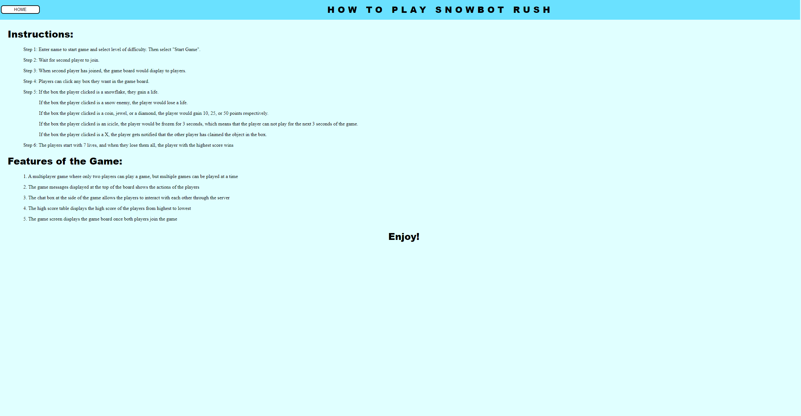

# Final Course Group Project - Team 45
Assignment completed for Software Systems Development and Integration "CSCI - 2020U" for the Winter 2023 semester by:
- Sara Bhoira - 100826813
- Chantel George - 100825272
- Fareeha Malik - 100785443
- Alagu Vallikkannan - 100822256

## Description
In this final course assignment, our group created a game "SnowbotRush". The objective of the game is for two players 
to compete with each other if they are playing at the same difficulty level. Once the game is started,
a game board appears on both the players screen individually. Both the game boards will have various "good" 
assets such as coins, diamonds, snowflakes or jewels. The game boards will also have various "bad" such as icicles 
or a water monster which causes the game to freeze or lose lives respectively. These assets have to be unveiled by clicking 
the "question marks" The robot character reflects these changes through its appearance. For instance when a player 
unveils the icicle, the robot character will have a frozen appearance. 

Essentially this is a game of chance as you will not know what is behind the qustion mark squares until it is clicked.
You are also competing with another player, who has the same selection of question mark boxes to unveil.

Players may also use with the in-game chat functionality.

## Interface and main functionalities
The screenshots below will help describe the interface and main functionalities of the game.

### In-course concept implementation
Below is detailed description of various concepts implemented within this project that include the course concepts
which we were taught throughout the semester:
- 
- 

## How To Clone and Run Application
1. Clone repository using the GitHub repository link by using the command: git clone.
2. Open the project in IntelliJ
3. Build the project
4. Edit configurations - add GlassFish Local Server, select domain, add artifact war exploded in the deployment, select 
apply and save
5. Run the server
6. Run the index.html file

## Resources
#### Various assets and front page background retrieved from:
1. Front page background retrieved from: https://www.freepik.com/free-photos-vectors/snow-city
2. Robot character retrieved from: https://www.vecteezy.com/vector-art/623956-cute-robot-box-character-designs-with-emotions-poses
3. Water monster character retrieved from: https://publicdomainvectors.org/en/free-clipart/Water-monster/67042.html
4. Coin asset retrieved from: https://pixlok.com/images/game-coin-clipart-png-image-free-download/
5. Diamond asset retrieved from: https://creazilla.com/nodes/35237-diamond-jewelry-clipart
6. Icicle asset retrieved from: https://creazilla.com/nodes/1688816-icicles-clipart
7. Jewel asset retrieved from: https://www.dreamstime.com/illustration/jewels.html

#### Resources used for a deeper understanding of concepts and to implement within our game:
1. https://www.w3schools.com/howto/howto_css_center_button.asp
2. https://www.geeksforgeeks.org/singleton-class-java/
3. https://www.w3schools.com/java/java_enums.asp
4. https://stackoverflow.com/questions/3990319/storing-integer-values-as-constants-in-enum-manner-in-java
5. https://www.java67.com/2014/10/how-to-create-and-initialize-two-dimensional-array-java-example.html
6. https://stackoverflow.com/questions/20389890/generating-a-random-number-between-1-and-10-java
7. https://docs.oracle.com/javase/8/docs/api/java/util/Set.html#method.summary
8. https://mkyong.com/java/java-get-keys-from-value-hashmap/#hashmap-only-has-one-item
9. https://www.w3schools.com/java/java_iterator.asp
10. https://stackoverflow.com/questions/109383/sort-a-mapkey-value-by-values
11. https://stackoverflow.com/questions/13546424/how-to-wait-for-a-websockets-readystate-to-change
12. https://www.w3schools.com/jsref/met_win_setinterval.asp
13. https://www.w3schools.com/jsref/met_element_removeattribute.asp
14. https://www.w3schools.com/jsref/met_document_createelement.asp
15. https://www.encodedna.com/javascript/populate-json-data-to-html-table-using-javascript.htm
16. https://fasterxml.github.io/jackson-databind/javadoc/2.7/index.html?com/fasterxml/jackson/databind/JsonNode.html
17. https://docs.oracle.com/javaee/6/tutorial/doc/bnags.html
18. https://www.w3schools.com/jsref/prop_style_cursor.asp
19. https://www.html-code-generator.com/css/textbox-style

### Libraries 
- jakarta
- jackson 

### Packages
- java.util
- java.io
- org.apache
- java.net

